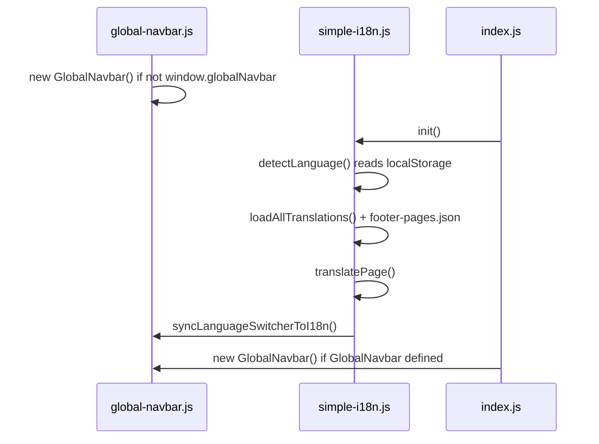

# Footer translations and language persistence

This document describes how **footer / legal pages** get translated at runtime, and how the **homepage navbar** remembers the selected language after a browser refresh.

It applies to the static app under `app/` (e.g. `Totilove1/app` locally). There is **one HTML file per page per language** — all locales share the same markup.

---

## Supported languages

| Code | Language |
|------|----------|
| `en` | English (source / fallback) |
| `vi` | Vietnamese |
| `th` | Thai |
| `zh` | Chinese |
| `fr` | French |
| `de` | German |
| `es` | Spanish |
| `it` | Italian |
| `ru` | Russian |
| `ph` | Filipino |

Defined in `app/assets/i18n/simple-i18n.js` (`supportedLanguages`).

---

## Key files

| Role | Path |
|------|------|
| Runtime i18n engine | `app/assets/i18n/simple-i18n.js` |
| Footer page bootstrap | `app/assets/js/new/footer-public-page.js` |
| Language switcher UI | `app/components/navbar/global-navbar.js` |
| Homepage init | `app/assets/js/new/pages/index.js` |
| Footer HTML (English default in DOM) | `app/pages/footer/*.html` |
| Generated footer strings (all locales) | `app/assets/i18n/footer-pages.json` |
| Per-locale overrides | `app/assets/i18n/footer-locale-overlays/<lang>.mjs` |
| Build script | `scripts/build-footer-pages-json.mjs` |
| Service worker (asset caching) | `app/assets/js/new/service-worker.js` |

Footer pages included in the build (not `help1.html`):

- `accessibility.html`, `contact.html`, `cookies.html`, `help.html`, `privacy.html`, `refund.html`, `safety.html`, `sitemap.html`, `terms.html`

---

## How footer translation works

### 1. HTML is the English shell

Each footer page is normal HTML with **`data-i18n`** (text) or **`data-i18n-html`** (HTML blocks) attributes. Example keys:

- `footerPage.terms.documentTitle`
- `footerPage.terms.heroTitleHtml`
- `footerPage.terms.cardInnerHtml`
- Shared footer chrome: `footer.brand`, `footer.privacyPolicy`, etc.

The visible English in the file is the **fallback** if JavaScript or the bundle fails to load.

### 2. Scripts on footer pages

At the end of `<body>`:

```html
<script src="/assets/i18n/simple-i18n.js"></script>
<script src="/assets/js/new/footer-public-page.js"></script>
```

There is **no** `global-navbar.js` on footer pages. Users cannot pick a language on those URLs unless you add the navbar later.

### 3. `footer-public-page.js` starts i18n

On `DOMContentLoaded` (or immediately if the document is already loaded), it:

1. Guards with `window.__totiloveFooterI18nStarted` so init runs once.
2. Calls `await window.simpleI18n.init()`.
3. Sets `#fp-year` to the current year.

### 4. `simple-i18n.js` loads strings and applies them

**`init()`** does:

1. **`detectLanguage()`** — picks the active locale (see [Language persistence](#language-persistence-on-refresh) below).
2. **`loadAllTranslations()`** — builds an in-memory `translations` object:
   - Large **embedded** object in `simple-i18n.js` for homepage hero, footer links, etc.
   - **`mergeFooterPageBundle()`** — `fetch`es `footer-pages.json` and merges `footerPage.*` keys per language.
3. **`translatePage()`** — walks every `[data-i18n]` node and sets text, `innerHTML`, `<title>`, or `<meta content>` from the active locale.

**`getTranslation(key)`** uses dot paths (`footerPage.terms.heroTitleHtml`). Missing keys fall back to **English**.

**`data-i18n-html`** — entire block content (e.g. legal body inside `.fp-card-i18n`) is replaced with translated HTML from the bundle.

### 5. Where footer copy lives

```text
app/pages/footer/terms.html          →  English source HTML
        │
        ▼  node scripts/build-footer-pages-json.mjs
app/assets/i18n/footer-pages.json    →  { en, vi, th, … } with footerPage.* trees
        ▲
app/assets/i18n/footer-locale-overlays/*.mjs  →  partial overrides per language
```

Build steps (`build-footer-pages-json.mjs`):

1. Parse each footer HTML file and extract titles, meta descriptions, hero text, and `.fp-card-i18n` inner HTML into `bundle.en`.
2. For each overlay language (`vi`, `th`, `zh`, …), **deep-merge** overlay onto `en` (same rules as runtime `deepMergeFooter`).
3. Write `app/assets/i18n/footer-pages.json`.

After editing footer HTML or overlays, **re-run the build** so `footer-pages.json` stays in sync.

### 6. Fetch URL and subpaths

`getFooterPagesBundleUrl()` returns:

```text
{pathPrefix}/assets/i18n/footer-pages.json?v=sw24
```

`getAssetsPathPrefix()` strips everything before `/pages/footer/` so nested deploy paths still resolve `/assets/...` correctly.

The `?v=sw…` query string helps bust **service worker / browser cache** when the bundle changes. Bump it when you ship a new `footer-pages.json`.

### 7. Runtime merge rule for non-English footer pages

In `mergeFooterPageBundle()`:

- `translations.en.footerPage` = full English bundle from JSON.
- For each other language: `translations[lang].footerPage = deepMergeFooter(bundle.en, bundle[lang] || {})`.

So incomplete overlays still show English for missing keys.

---

## Language persistence on refresh

### Single source of truth: `localStorage`

| Key | Value |
|-----|--------|
| `totilove_ui_lang` | One of the supported language codes (e.g. `vi`, `fr`) |

Written by `simpleI18n.setLanguagePreference()` inside **`switchLanguage()`**.

Read by:

- `simpleI18n.detectLanguage()` on every **`init()`** (homepage and footer).
- `globalNavbar.syncLanguageSwitcherToI18n()` to align the dropdown label with stored locale.

### Choosing language on first visit

If `totilove_ui_lang` is missing or invalid, `detectLanguage()` tries:

1. `getLanguagePreference()` (session user — currently returns `null` for guests).
2. Browser `navigator.language` (first segment, e.g. `en` from `en-US`).
3. Default **`en`**.

### Homepage: navbar + i18n flow

**Scripts** (`app/pages/index.html`, all `defer`, in order):

1. `simple-i18n.js`
2. `global-navbar.js`
3. `pages/index.js`

**On `DOMContentLoaded`:**



`global-navbar.js` auto-inits on `DOMContentLoaded` and skips if `window.globalNavbar` already exists. `index.js` may create another instance only when `GlobalNavbar` is defined and no instance exists (behavior can vary by branch).

**User picks a language** in the navbar dropdown:

1. Click option → `window.selectLanguage(lang, element)` (`setupLanguageSwitcher`).
2. Updates dropdown UI (flag + label) when `#selectedLanguage` / `#languageOptions` exist.
3. **`await window.simpleI18n.switchLanguage(lang)`** which:
   - Sets `currentLanguage`
   - **`localStorage.setItem('totilove_ui_lang', lang)`**
   - `translatePage()`
   - Dispatches `languageChanged` custom event
   - Calls `syncLanguageSwitcherToI18n()` again

### After refresh on the homepage

1. `simpleI18n.init()` runs → `detectLanguage()` reads **`totilove_ui_lang`** → content loads in that language.
2. Navbar HTML may still show the default English label until **`syncLanguageSwitcherToI18n()`** runs (called from `init()` and after `switchLanguage()`).
3. That method reads `localStorage`, finds `[data-lang="vi"]` (etc.), and copies its inner HTML into `#selectedLanguage`.

So **persistence is storage + re-init**, not a separate “remember navbar” API.

### Footer pages after refresh

1. User previously chose e.g. Vietnamese on the homepage → `totilove_ui_lang` = `vi`.
2. User opens `/pages/footer/privacy.html`.
3. `footer-public-page.js` → `simpleI18n.init()` → `detectLanguage()` → **`vi`**.
4. `footer-pages.json` merged → `translatePage()` replaces all `data-i18n` / `data-i18n-html` content.

**Important:** Footer pages have **no language dropdown**. If the user opens a footer URL in a **new browser** without ever visiting the homepage, they get browser language or English until they set `totilove_ui_lang` (e.g. from the homepage switcher).

### Direct link / new tab behavior

| Scenario | Result |
|----------|--------|
| Set language on homepage, then open footer | Translated (same `localStorage`) |
| Open footer first, never set language | English or browser locale only |
| Clear site data / private window | English unless browser locale is supported |
| Old service worker cached stale `footer-pages.json` | May show English blocks until cache updates; network-first for `/assets/i18n/` in SW v5+ helps |

---

## Service worker and caching

`app/assets/js/new/service-worker.js` uses **network-first** for:

- `/assets/css/`
- `/assets/js/`
- `/assets/i18n/` (includes `simple-i18n.js` and `footer-pages.json`)

Older cache-first behavior could serve an outdated English-only bundle. After changing translations, bump the **`?v=sw…`** suffix in `getFooterPagesBundleUrl()` and deploy a new service worker version if needed.

---

## Operational checklist

### Change footer legal text (English)

1. Edit the relevant `app/pages/footer/<page>.html`.
2. Run: `node scripts/build-footer-pages-json.mjs`
3. Commit updated HTML + `footer-pages.json` (+ overlays if you changed them).
4. Bump `footer-pages.json?v=sw…` if clients still see old copy.

### Add or fix a non-English footer string

1. Edit or add `app/assets/i18n/footer-locale-overlays/<lang>.mjs`.
2. Re-run the build script.
3. Verify keys under `footerPage.<page>.*` in generated JSON.

### Verify locally

1. Run the app server from the project that serves `app/`.
2. Open homepage → switch language → confirm UI and `localStorage.totilove_ui_lang`.
3. Hard refresh → navbar label and content should match stored language.
4. Open a footer page → same language without using the dropdown there.

---

## What this stack does *not* do

- **No** server-side locale routing (no `/vi/pages/footer/terms.html`).
- **No** separate JSON files per page at runtime — one `footer-pages.json` for all footer pages.
- **`app/assets/i18n/translations/*.json`** is not loaded by `simple-i18n.js` for this flow.
- Footer pages do not load `global-navbar.js` by default (no on-page language switcher).

---

## Related homepage markup

Homepage strings use the same `data-i18n` attributes and the **embedded** translation tables inside `simple-i18n.js` (hero, features, footer section on index). Footer legal pages additionally depend on **`footer-pages.json`**.

---

*Last updated: May 2026 — reflects `Totilove1/app` layout.*
